# SupportFlow — Data Model

The Phase D deliverable: entity-relationship diagram, table reference, index
strategy, and the constraints that encode business rules in the schema rather than
in application code.

The models in [`backend/app/models/`](../backend/app/models/) are the source of this
document. Where the two disagree, the models are right and this file is a bug.

Diagrams use Mermaid rather than ASCII — the rest of `docs/` is ASCII, but fifteen
entities and forty-odd foreign keys do not survive a text rendering. Mermaid is
rendered natively by GitHub and by VS Code, so it needs no external tool and stays
diffable.

---

## 1. Entity-relationship diagram

Timestamps are omitted from the diagram for legibility. Every table carries
`created_at` and `updated_at` except the append-only ones (`ticket_events`,
`audit_logs`, `notifications`, `ai_usage`, `refresh_tokens`), which carry only
`created_at` because editing history would defeat their purpose.

Every table except `organizations` carries a non-nullable, indexed `organization_id`
with a foreign key to `organizations`. Those edges are drawn, because the schema's
central claim is that tenant ownership is universal and structural — not a convention
applied to some tables.

```mermaid
erDiagram
    ORGANIZATIONS ||--o{ USERS : "employs"
    ORGANIZATIONS ||--o{ CUSTOMERS : "serves"
    ORGANIZATIONS ||--o{ TICKETS : "owns"
    ORGANIZATIONS ||--o{ MESSAGES : "owns"
    ORGANIZATIONS ||--o{ ATTACHMENTS : "owns"
    ORGANIZATIONS ||--o{ TICKET_EVENTS : "owns"
    ORGANIZATIONS ||--o{ AI_ANALYSES : "owns"
    ORGANIZATIONS ||--o{ AI_USAGE : "owns"
    ORGANIZATIONS ||--o{ KNOWLEDGE_DOCUMENTS : "owns"
    ORGANIZATIONS ||--o{ KNOWLEDGE_CHUNKS : "owns"
    ORGANIZATIONS ||--o{ SLA_POLICIES : "defines"
    ORGANIZATIONS ||--o{ AUDIT_LOGS : "owns"
    ORGANIZATIONS ||--o{ NOTIFICATIONS : "owns"
    ORGANIZATIONS ||--o{ REFRESH_TOKENS : "owns"

    CUSTOMERS ||--o{ TICKETS : "raises"
    CUSTOMERS |o--o{ USERS : "portal login for"

    USERS ||--o{ REFRESH_TOKENS : "holds"
    USERS |o--o{ TICKETS : "assigned to"
    USERS |o--o{ MESSAGES : "authors"
    USERS |o--o{ TICKET_EVENTS : "acts in"
    USERS |o--o{ KNOWLEDGE_DOCUMENTS : "creates"
    USERS ||--o{ NOTIFICATIONS : "receives"
    USERS |o--o{ AUDIT_LOGS : "acts in"
    USERS |o--o{ AI_USAGE : "attributed to"

    TICKETS ||--o{ MESSAGES : "contains"
    TICKETS ||--o{ ATTACHMENTS : "carries"
    TICKETS ||--o{ TICKET_EVENTS : "records"
    TICKETS ||--o{ AI_ANALYSES : "analysed by"
    TICKETS |o--o{ AI_USAGE : "billed to"
    TICKETS |o--o{ NOTIFICATIONS : "concerns"

    MESSAGES |o--o{ ATTACHMENTS : "attached to"

    KNOWLEDGE_DOCUMENTS ||--o{ KNOWLEDGE_CHUNKS : "split into"

    REFRESH_TOKENS |o--o| REFRESH_TOKENS : "rotated to"

    ORGANIZATIONS {
        uuid id PK
        text name
        text slug UK "globally unique, used in URLs"
        enum plan "free | pro | enterprise"
        enum status "active | suspended"
    }

    USERS {
        uuid id PK
        uuid organization_id FK
        uuid customer_id FK "set only when role=customer"
        text name
        text email "unique within the organization"
        text password_hash "Argon2id, never serialized"
        enum role "admin | manager | agent | customer"
        bool is_active "checked per request, not just at login"
        timestamptz last_login_at
    }

    REFRESH_TOKENS {
        uuid id PK
        uuid organization_id FK
        uuid user_id FK
        text token_hash UK "SHA-256 of the token, never the token"
        timestamptz expires_at
        timestamptz revoked_at "null means live"
        uuid replaced_by_id FK "rotation chain"
        text user_agent "investigation only"
        text ip_address "investigation only, fits IPv6"
    }

    CUSTOMERS {
        uuid id PK
        uuid organization_id FK
        text name
        text email "unique within the organization"
        text phone
        text external_reference "CRM or billing system id"
        jsonb extra_data "plan tier, VIP flag"
    }

    SLA_POLICIES {
        uuid id PK
        uuid organization_id FK
        enum priority "one policy per priority per tenant"
        int response_time_minutes
        int resolution_time_minutes
        int warning_threshold_percent "warn before breaching"
        bool is_active
    }

    TICKETS {
        uuid id PK
        uuid organization_id FK
        int number "per-tenant reference, e.g. #1042"
        uuid customer_id FK
        uuid assigned_agent_id FK "null when unassigned"
        text subject
        text description
        enum status "open | assigned | in_progress | waiting_for_customer | resolved | closed"
        enum priority "low | medium | high | urgent"
        text category
        text subcategory
        enum sentiment "positive | neutral | negative"
        float sentiment_confidence
        enum ai_recommended_priority "what the model suggested"
        float ai_priority_score
        float ai_classification_confidence
        timestamptz first_response_at "SLA measurement"
        timestamptz resolved_at
        timestamptz closed_at
    }

    MESSAGES {
        uuid id PK
        uuid organization_id FK
        uuid ticket_id FK
        uuid sender_user_id FK "null for system and AI"
        enum sender_type "customer | agent | system | ai_draft"
        text body
        bool is_internal "staff-only note"
    }

    ATTACHMENTS {
        uuid id PK
        uuid organization_id FK
        uuid ticket_id FK
        uuid message_id FK "null when uploaded standalone"
        uuid uploaded_by_id FK
        text filename "displayed, never used to build a path"
        text storage_key UK "server-generated object key"
        text content_type "detected server-side"
        bigint size_bytes
    }

    TICKET_EVENTS {
        uuid id PK
        uuid organization_id FK
        uuid ticket_id FK
        uuid actor_user_id FK "null when the system acted"
        enum event_type "assign, status, priority, SLA, reopen, ..."
        text from_value
        text to_value
        jsonb extra_data
    }

    AI_ANALYSES {
        uuid id PK
        uuid organization_id FK
        uuid ticket_id FK
        enum operation "classify | sentiment | summarize | suggest_response | ..."
        enum status "pending | processing | completed | failed"
        jsonb result "validated model output"
        float confidence
        text provider
        text model
        int prompt_tokens
        int completion_tokens
        int latency_ms
        text error_message
        timestamptz completed_at
    }

    AI_USAGE {
        uuid id PK
        uuid organization_id FK
        uuid ticket_id FK "null for ingestion calls"
        uuid user_id FK "null for background calls"
        enum operation
        text provider
        text model
        int prompt_tokens
        int completion_tokens
        numeric cost_usd "6dp, money is summed"
        int latency_ms
        bool was_successful "failures still consume quota"
        bool was_cached "measures real cache saving"
    }

    KNOWLEDGE_DOCUMENTS {
        uuid id PK
        uuid organization_id FK
        uuid created_by_id FK
        text title
        text content "retained so re-chunking needs no refetch"
        enum source_type "upload | url | manual"
        text source_reference
        enum status "ingestion state"
        text error_message
        int chunk_count "denormalized"
        bool is_published "editorial gate, defaults false"
        timestamptz processed_at
    }

    KNOWLEDGE_CHUNKS {
        uuid id PK
        uuid organization_id FK
        uuid document_id FK
        int chunk_index "unique within the document"
        text content
        vector embedding "1536 dims, HNSW cosine"
        text embedding_model "stale-vector detection"
        int token_count
    }

    AUDIT_LOGS {
        uuid id PK
        uuid organization_id FK
        uuid actor_user_id FK "null after the actor is deleted"
        text actor_email "denormalized, survives deletion"
        enum action
        text target_type "polymorphic, not a foreign key"
        uuid target_id
        jsonb extra_data
        text ip_address
        text user_agent
    }

    NOTIFICATIONS {
        uuid id PK
        uuid organization_id FK
        uuid user_id FK
        uuid ticket_id FK
        enum notification_type
        text title
        text body
        timestamptz read_at "null means unread"
    }
```

### Why `audit_logs.target` is not a foreign key

`target_type` + `target_id` identify the row an action applied to. A real foreign key
would either cascade — destroying the record of a deletion, which is exactly the event
most worth keeping — or block the delete outright. The audit log has to outlive its
subjects.

`actor_email` is denormalized for the same reason: `actor_user_id` becomes `NULL` when
a user is deleted, so "who did this" would otherwise have no answer, and a later email
change must not rewrite history.

---

## 2. Table reference

| Table | Rows describe | Tenant-scoped | Append-only |
|---|---|---|---|
| `organizations` | A tenant | *is* the scope | no |
| `users` | Staff and customer-portal logins | yes | no |
| `refresh_tokens` | Issued session credentials | yes | yes |
| `customers` | Support contacts | yes | no |
| `tickets` | Support requests | yes | no |
| `messages` | Ticket conversation and notes | yes | no |
| `attachments` | Uploaded file metadata | yes | no |
| `ticket_events` | Ticket activity timeline | yes | yes |
| `ai_analyses` | AI call history per ticket | yes | no |
| `ai_usage` | AI token and cost ledger | yes | yes |
| `knowledge_documents` | Knowledge-base sources | yes | no |
| `knowledge_chunks` | Embedded passages | yes | no |
| `sla_policies` | Per-priority SLA targets | yes | no |
| `audit_logs` | Organization-wide audit trail | yes | yes |
| `notifications` | Per-user alerts | yes | yes |

The spec names 14 models. The fifteenth, `refresh_tokens`, exists because the spec
requires revocable refresh tokens (§10) and a JWT cannot be revoked without a
server-side record. See ADR-003 for why these are opaque rather than JWTs.

---

## 3. Index strategy

The spec (§51) names the indexes that must exist: `organization_id`, ticket status,
ticket priority, assigned agent, customer, and `created_at`. Those are satisfied by
composite indexes rather than one index per column — a single-column index on `status`
would match a large share of a tenant's rows and be nearly useless.

`organization_id` leads every composite index, because every query in the system
filters on it first.

### Tickets

| Index | Columns | Serves |
|---|---|---|
| `ix_tickets_org_agent_status_created` | org, agent, status, created_at | Agent queue: *my open tickets, newest first* |
| `ix_tickets_org_status_priority` | org, status, priority | Manager queue: *all open tickets by priority* |
| `ix_tickets_org_created_at` | org, created_at | Default list ordering, date ranges |
| `ix_tickets_org_customer_created` | org, customer, created_at | Customer portal: *my tickets* |
| `ix_tickets_org_category` | org, category | Analytics grouping |
| `ix_tickets_sla_pending` | org, priority, created_at *(partial)* | SLA sweep over unresolved tickets only |
| `ix_tickets_fts` | `to_tsvector('english', subject \|\| description)` *(GIN)* | Full-text search |
| `uq_tickets_org_number` | org, number *(unique)* | Human-facing ticket reference |

### Other tables

| Index | Purpose |
|---|---|
| `ix_customers_name_trgm`, `ix_customers_email_trgm` *(GIN, pg_trgm)* | Fuzzy `ILIKE '%term%'` search, which a B-tree cannot serve |
| `ix_knowledge_documents_title_trgm` | Title search in the admin list |
| `ix_knowledge_chunks_embedding_hnsw` *(HNSW, `vector_cosine_ops`)* | Approximate nearest-neighbour retrieval |
| `ix_knowledge_chunks_org_document` | Tenant-scoped pre-filter for vector search |
| `ix_notifications_user_unread` *(partial)* | Unread badge — read rows accumulate and are never counted |
| `ix_notifications_user_created` | Full notification history, and the retention purge |
| `ix_ai_analyses_ticket_operation_created` | Latest analysis per operation on the ticket screen |
| `ix_ai_analyses_pending` *(partial)* | Retry sweep |
| `ix_knowledge_documents_pending` *(partial)* | Ingestion queue |
| `ix_knowledge_documents_org_published` *(partial)* | Published, fully-processed documents for retrieval |
| `ix_ai_usage_org_created` | Monthly spend rollup, quota enforcement |
| `ix_ai_usage_org_operation_created` | Which feature is expensive |
| `ix_ai_usage_org_user_created` | Per-user attribution |
| `ix_audit_logs_org_created` | An organization's recent activity |
| `ix_audit_logs_org_actor_created` | Access review: *what did this user do?* |
| `ix_audit_logs_target` | History of one entity |
| `ix_audit_logs_org_action_created` | Filter by action type |
| `ix_messages_ticket_created` | A ticket's full thread in order |
| `ix_messages_ticket_public_created` *(partial)* | Customer-visible thread |
| `ix_ticket_events_ticket_created` | One ticket's timeline in order |
| `ix_attachments_ticket_created` | A ticket's attachments |
| `ix_refresh_tokens_user_id_revoked_at` | Hot path: find a live token |
| `ix_refresh_tokens_expires_at` | Periodic expiry sweep |
| `ix_organizations_slug`, `ix_organizations_status` | Tenant lookup by slug; filtering suspended tenants |
| `ix_users_email`, `ix_users_role` | Staff lookup by email; filtering by role |
| `ix_customers_email`, `ix_customers_external_reference` | Contact lookup; CRM reconciliation |

Single-column indexes on foreign keys not covered by a composite
(`ix_attachments_message_id`, `ix_notifications_ticket_id`,
`ix_refresh_tokens_user_id`, `ix_users_customer_id`) are generated by `index=True`
on the column and exist so an unindexed foreign key never forces a sequential scan
on delete.

### `organization_id` is indexed once per table

`OrganizationScopedMixin` indexes `organization_id` by default, so a new tenant table
cannot silently lose the index. Nine tables opt out with `__org_index__ = False`
because another index or unique constraint already *leads* with `organization_id`,
and a B-tree on `(organization_id, …)` serves a predicate on `organization_id` alone.
The standalone index would be maintained on every insert and serve nothing.

| Table | What leads with `organization_id` instead |
|---|---|
| `tickets` | seven composites and `uq_tickets_org_number` |
| `users`, `customers` | `uq_…_organization_id_email` |
| `sla_policies` | `uq_sla_policies_organization_id_priority` |
| `knowledge_chunks` | `ix_knowledge_chunks_org_document` |
| `knowledge_documents` | `ix_knowledge_documents_org_published`, `…_pending` |
| `ai_analyses` | `ix_ai_analyses_pending` |
| `ai_usage` | all three `ix_ai_usage_org_*` |
| `audit_logs` | all four `ix_audit_logs_org_*` |

The remaining five tenant tables keep the standalone index, because nothing else leads
with `organization_id` there: `messages`, `attachments`, `ticket_events`,
`notifications`, `refresh_tokens` — each is reached through `ticket_id`, `user_id`, or
`document_id`.

A UNIQUE constraint is backed by a real unique B-tree in PostgreSQL, which is why the
two per-tenant email constraints and the SLA policy constraint count here. Every
tenant table therefore still has an index whose leading column is `organization_id`.

### Two index choices worth stating

**HNSW over IVFFlat** for embeddings. IVFFlat needs a training step over existing rows
and degrades as data is added incrementally; HNSW needs no training and stays accurate
under continuous ingestion, which is what a knowledge base does. The operator class
must match the query operator — `vector_cosine_ops` here means retrieval has to use
`<=>`, or Postgres silently ignores the index.

**Partial indexes** for the SLA sweep, unread notifications, and both pending-work
queues. Each targets a small, hot subset of a table whose majority is cold
(resolved tickets, read notifications, completed jobs). Excluding those rows keeps the
index small enough to stay resident.

---

## 4. Constraints that encode business rules

These are in the schema rather than the service layer, so a bug in application code
cannot violate them.

| Constraint | Table | Rule |
|---|---|---|
| `internal_note_not_from_customer` | messages | An internal note cannot be authored by a customer |
| `ai_draft_is_internal` | messages | An AI draft can never be customer-visible |
| `resolved_at_matches_status` | tickets | `resolved`/`closed` require `resolved_at` |
| `ai_classification_confidence_range` | tickets | Confidence is a probability in [0,1] |
| `sentiment_confidence_range` | tickets | Same |
| `confidence_range` | ai_analyses | Same |
| `terminal_status_has_payload` | ai_analyses | Completed carries a result; failed carries an error |
| `latency_non_negative` | ai_analyses | — |
| `resolution_after_response` | sla_policies | An unsatisfiable SLA is rejected |
| `warning_threshold_range` | sla_policies | Warning fires strictly before the target |
| `size_bytes_positive` | attachments | — |
| `chunk_index_non_negative`, `token_count_positive` | knowledge_chunks | — |
| `cost_non_negative`, token counts | ai_usage | — |

The two `messages` constraints are the most important. The spec forbids AI output
reaching a customer unreviewed and requires internal notes to stay internal. Making
those schema guarantees means the failure mode is a rejected write, not a leak.

### A JSON `null` is not an absent value

PostgreSQL distinguishes SQL `NULL` from JSON `null`, and only the former fails
`IS NOT NULL`. SQLAlchemy persists Python `None` as JSON `null` by default, so an
explicit `none_as_null=True` is set on `ai_analyses.result` and on the four
`extra_data` columns. `terminal_status_has_payload` additionally excludes
`'null'::jsonb` explicitly, so a raw `INSERT` cannot mark an analysis completed with
no usable payload.

This was a real defect, found by testing against PostgreSQL. Through the ORM the
stored `null` read back as `None` either way, so nothing in Python could have noticed.

---

## 5. Deletion behaviour

| Deleted | Effect | Reasoning |
|---|---|---|
| An organization | Cascades to all its data | Removing a tenant removes its data rather than orphaning it |
| A ticket | Cascades to messages, attachments, events, analyses | All are parts of the ticket |
| A knowledge document | Cascades to its chunks | Chunks are derived data |
| A user | `SET NULL` on tickets, messages, events, audit logs | Deactivating an agent must not delete their ticket history |
| A customer | `SET NULL` on `users.customer_id` | Removing a contact must not delete the login |
| A ticket | `SET NULL` on `ai_usage.ticket_id` | Spend that vanishes when a ticket is deleted cannot be reconciled |
| A message | `SET NULL` on `attachments.message_id` | An attachment outlives the message it arrived with |

The rule: cascades follow *composition* (the child has no meaning alone), and
`SET NULL` follows *attribution* (the record must survive its actor).

---

## 6. Enum types

Thirteen native PostgreSQL enum types, declared once each in
[`enums.py`](../backend/app/models/enums.py) and reused across every column of that
type. Two details are centralized there because both are easy to get wrong per-column:

- **Values, not names.** SQLAlchemy persists an enum member's *name* by default, so
  `TicketStatus.OPEN` would be stored as `"OPEN"`. Every value is lowercase by
  convention and the check constraints and partial indexes above compare against
  lowercase literals, so names would mismatch silently.
- **One object per type.** A `CREATE TYPE` is emitted per distinct type object, so
  columns sharing a type (`tickets.priority` and `tickets.ai_recommended_priority`)
  must share it or DDL tries to create the type twice.

Adding a value later requires an explicit `ALTER TYPE` in a migration. That is a
deliberate constraint: it makes the schema self-documenting and prevents a status
appearing in code that the database will reject at 3am.

Types: `user_role`, `organization_plan`, `organization_status`, `ticket_status`,
`ticket_priority`, `sentiment`, `sender_type`, `processing_status`,
`document_source_type`, `ticket_event_type`, `audit_action`, `notification_type`,
`ai_operation`.

---

## 7. Notes and open items

**Ticket numbering is not sequence-backed.** `tickets.number` is allocated by the
service layer, and a global sequence was rejected because it would leak total ticket
volume across tenants and skip numbers per tenant.

As of Phase I–K the allocation is implemented, and it is **not** a read-then-retry:
`TicketRepository.allocate_number` takes a transaction-scoped
`pg_advisory_xact_lock` keyed on the organization id and then reads
`MAX(number) + 1`. The lock makes a collision impossible rather than merely recoverable,
is released on commit or rollback with nothing to clean up, and is per-tenant so two
organizations never contend. The unique index on `(organization_id, number)` stays as
the invariant backstop.

The cost is that ticket creation serializes *within* a tenant — one short transaction on
a low-frequency write. The alternative, a bounded retry around the integrity error, is
more machinery than the problem deserves, because a failed statement aborts the whole
transaction and so a retry needs a `SAVEPOINT`, an attempt limit, and a test for the
exhaustion path. See ADR-016.

**The schema is produced by a migration.** `backend/alembic/versions/` holds a single
baseline revision that creates every table, enum type, index, and constraint described
above. The test suite builds its schema from metadata instead, for speed; the drift
check in `tests/integration/test_migrations.py` asserts that metadata autogenerates to
an empty diff against a migrated database, which is what keeps the two honest. See
ADR-012 and the migration commands in the [README](../README.md).

**One model declaration is written in PostgreSQL's own words.** `ix_tickets_fts` is an
expression index, and the catalog normalises its expression — the config literal
becomes a `regconfig` cast and the operands gain `::text`. Autogenerate compares index
expressions as text, so the model matches the stored form verbatim. Left in its
natural spelling, every later `alembic revision --autogenerate` would emit a
drop-and-recreate of this index.

**Ticket transitions** are defined alongside the enums (`TICKET_TRANSITIONS`,
`can_transition`) so the rule has one source of truth shared by the service layer and
the tests. See [requirements.md](requirements.md) §5 for the lifecycle itself.
